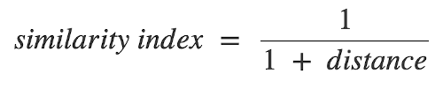

You can try this recommender [here](http://spotify-recommender.gabrielballesteros.com/home)

# How does it work?
Basically, it asks for the user to select their favorite tracks from Spotify, then it compares each of them - one by one - with every track in the recommender dataset. In order to do this it gets the tracks' audio features provided by the Spotify API and computes the euclidean distance between the inputted tracks and the dataset tracks to generate a similarity index. The recommended tracks are the ones from the dataset with the highest similarity index compared to each of the inputted tracks (closest to 1.0).

# The distance
The general idea is to compare the difference between all the features of the inputted tracks against the features of each of the tracks in the dataset. To do this, we use euclidean distance.

For example, if we had only 2 features (or dimensions) named 1 as the horizontal axis and 2 as the vertical axis, we could see the tracks as the points p and q and the distance between them in a plane like this:

Or, if we had more dimensions n like in our case where n = 8:

Where p and q are the tracks and the subindexes (1, 2, ..., i, ..., n) are the features (acousticness, danceability, etc.)

and choose the track with similarity closest to 1.0 among the ones in the dataset.
